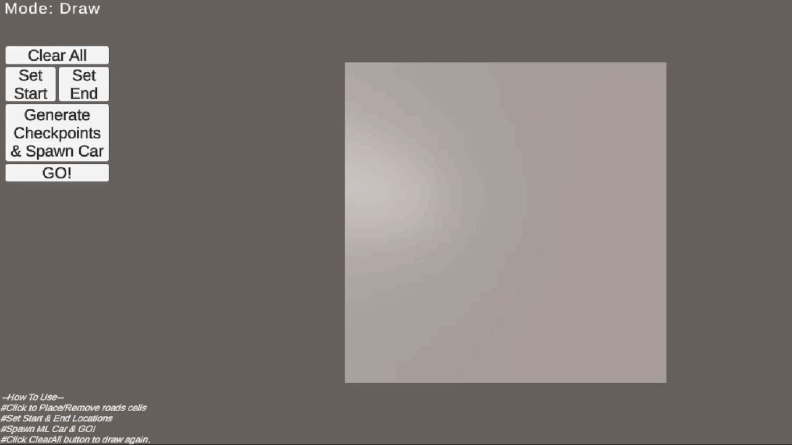

# RL Self-Driving Car (Unity ML-Agents)

## Overview
This project implements a reinforcement learning-based autonomous car using Unity ML-Agents and the Proximal Policy Optimization (PPO) algorithm.

The agent is trained on both static and procedurally generated tracks to study generalization. Procedural generation is used to prevent memorization and improve performance on unseen environments.

---

## Key Features
- Reinforcement Learning using PPO  
- Procedural Track Generation (PCG) for improved generalization  
- Static track training for baseline comparison  
- Custom runtime track editor for interactive testing  
- Dedicated evaluation environment with logging  
- Real-time simulation in Unity  

---

## Tech Stack
- Unity (C#)
- Unity ML-Agents Toolkit  
- Python  
- PPO (policy gradient method)  

---

## Demo
## Track Editor Demonstration



## Generalization Comparison

The static-trained agent fails to adapt to unseen tracks, while the procedurally trained agent generalizes and completes the same track.

| Static Training (Fails) | Procedural Training (Generalizes) |
|------------------------|-----------------------------------|
|  |  |

---

## How It Works

### Environments
The project is organized into multiple Unity scenes, each designed for a specific purpose:

- Runtime Testing Environment  
  Allows manual drawing of custom tracks to test agent behavior interactively  

- Evaluation Environment  
  Runs trained models and logs performance metrics for analysis  

- Procedural Training Environment  
  Uses runtime procedural generation to create diverse tracks for training  

- Static Training Environment  
  Uses fixed track layouts for baseline training and comparison  

---

### Training
- Algorithm: PPO  
- Observations: (update based on your implementation, e.g., raycasts, sensors, position)  
- Actions: Steering, acceleration, braking  

---

### Reward Function
- Positive reward for staying on track  
- Penalty for collisions or going off-track  
- Encourages stable and efficient driving behavior  

---

## Results
- Procedural training improves generalization across unseen tracks  
- Static training shows faster convergence but lower adaptability  
- Evaluation environment enables consistent benchmarking  

---

## Setup Instructions

### Clone Repository
```bash
git clone https://github.com/athakkumar/Vehicle_Navigation_RL.git
cd repo-name
```

### Install Dependencies
```bash
pip install -r requirements.txt
```

### Open in Unity
- Open Unity Hub  
- Add the project folder  
- Open the appropriate scene  

### Train Model
```bash
mlagents-learn ppo_runtime.yaml --run-id=run_01
```

---

## Project Structure

```
Assets/
│
├── Scenes/
│   ├── RuntimeTesting        # Draw custom tracks and test agent behavior  
│   ├── Evaluation            # Model evaluation and logging  
│   ├── ProceduralTraining    # Training with procedural track generation  
│   └── StaticTraining        # Training on fixed tracks  
│
Packages/            # Unity dependencies  
ProjectSettings/     # Unity settings  
results/             # Training outputs (graphs, logs)  
ppo_runtime.yaml     # PPO configuration  
```

---

## Key Learnings
- Environment diversity improves generalization in reinforcement learning  
- Reward design significantly affects learning stability  
- Procedural generation reduces overfitting compared to static environments  

---

## Future Work
- Domain randomization  
- Sim-to-real transfer  
- More complex environments  
- Multi-agent systems  

---

## Author
Athak Kumar Verma